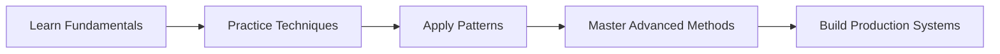

# Welcome to AI Prompting Guide

Master the art of **effective AI prompting** and unlock the full potential of AI language models through strategic, well-crafted prompts.

## What is AI Prompting?

AI prompting is the skill of crafting precise, contextual instructions that guide AI models to produce the exact outputs you need. Whether you're building applications, automating workflows, or enhancing productivity, effective prompting is your key to success.

## Why This Guide Matters

In the rapidly evolving world of AI, the difference between mediocre and exceptional results lies not just in the model you use, but in **how you communicate with it**. This guide will teach you:

- **Fundamental principles** of effective prompt engineering
- **Practical techniques** used by AI professionals
- **Real-world examples** across different domains
- **Advanced strategies** for complex use cases
- **Best practices** for production environments

## What You'll Learn

### 🎯 Prompt Fundamentals
Master the core concepts of prompt structure, context setting, and instruction clarity that form the foundation of effective AI interaction.

### 🔧 Practical Techniques
Learn battle-tested prompting patterns including few-shot learning, chain-of-thought reasoning, and role-based prompting.

### 🚀 Advanced Strategies
Explore sophisticated approaches like prompt chaining, dynamic context management, and multi-modal prompting.

### 💡 Real-World Applications
See how prompting techniques apply to content creation, code generation, data analysis, customer service, and more.

## Getting Started

Ready to transform how you work with AI? Start with our [Fundamentals](/docs/fundamentals/what-is-prompting) section to build a solid foundation, then progress through practical tutorials and advanced techniques.



:::tip Quick Start
New to AI prompting? Jump straight to our [Quick Start Guide](/docs/fundamentals/quick-start) for immediate practical results.
:::

## Interactive Examples

Throughout this guide, you'll find interactive code examples that you can copy and adapt for your own projects:

```python
# Example: Basic prompt structure
prompt = """
You are a helpful assistant specialized in data analysis.

Task: Analyze the following sales data and provide insights.
Context: Q3 2024 performance review
Data: [sales_data]

Please provide:
1. Key trends observed
2. Performance highlights
3. Recommendations for Q4

Format your response as a structured report.
"""
```

Let's begin your journey to AI prompting mastery!