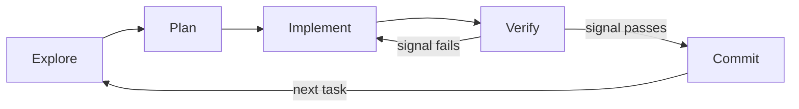

# Agentic Workflows: Plan, Delegate, Verify

Agentic coding tools are not autocomplete. They run a loop: read the codebase, form a plan, make edits, check their work, and repeat. Getting good results is less about prompt wording and more about *workflow discipline* — how you scope a session, what you delegate, how you parallelize, and how you force the agent to prove its work. This doc covers that cross-tool workflow layer. For how a specific tool implements plan mode, subagents, or headless runs, see the [Claude Code](/docs/vibe-coding/claude-code) and [OpenAI Codex](/docs/vibe-coding/openai-codex) guides; for an orientation to the whole approach, see the [Vibe Coding overview](/docs/vibe-coding/overview).

## The agentic loop is the spine

Every productive session walks the same five stages. Treat them as explicit phases, not a blur.



- **Explore** — let the agent read the relevant files and restate the problem before touching anything.
- **Plan** — produce a written plan of the steps and the files involved.
- **Implement** — make the edits, one coherent change at a time.
- **Verify** — run a machine-checkable signal (see below) and loop back on failure.
- **Commit** — capture the working state, then move on.

### Separate planning from execution

The single highest-leverage habit is to *separate the plan from the edits*. Most agentic tools ship a read-only "plan mode" precisely for this: the agent investigates and proposes, but cannot modify files until you approve. Reviewing a plan is cheap; reviewing a hundred lines of wrong diff is not. Approve, redirect, or refine the plan first — then let execution run against an agreed target.

The two tool guides describe how each one enters and exits plan mode; this doc only asserts the principle. Bouncing back to the plan stage when verification fails is normal and expected — that backward edge in the diagram is the loop doing its job.

## Context is the central constraint

At the workflow level, the resource you are managing is the context window. Every file read, every tool result, and every wrong turn stays in the session and competes for the model's attention. Two rules follow.

**Keep a session scoped to one coherent task.** A session that fixes a bug, then renames a module, then explores a new feature accumulates unrelated history. The model starts conflating concerns, and quality degrades — the classic "kitchen-sink" session.

**Reset or compact between unrelated tasks.** When you switch to something genuinely new, clear the context (start fresh) or compact it down to a short summary. A clean window with a focused brief outperforms a long window full of stale detail almost every time.

This is the workflow-level view. What actually belongs *inside* a context file or system prompt — and how to structure it — is the subject of the Context Engineering doc (mentioned by name; it is its own topic).

## Delegate to subagents

A subagent is a separate agent run that executes in *its own* context window and reports back only a summary. This is the cleanest way to do expensive reading without polluting your main session.

The pattern: when a task needs broad research — "find every place we construct a database connection," "summarize how auth works across these twelve files" — hand it to a subagent. It burns its own context churning through files and returns a few paragraphs. Your main session stays lean and keeps its attention on the task you care about.

Subagents also take on **specialized roles**:

- a **reviewer** that reads a diff and reports gaps (covered under verification below),
- a **test-writer** that produces tests against a spec without seeing the implementation,
- a **researcher** that gathers facts and surfaces a summary.

The discipline is the same in every case: the subagent absorbs the noise; the main context receives only the distilled result.

## Parallelize with git worktrees

When you have several *independent* tasks, run agents concurrently. The enabling mechanism is **git worktrees**: a worktree is a separate working directory backed by the same repository, each on its own branch. Give every agent its own worktree and the agents edit different checkouts, so their changes never collide on disk.

```bash
# one isolated checkout + branch per agent
git worktree add ../proj-feature-a -b feature-a
git worktree add ../proj-feature-b -b feature-b
# point one agent session at each directory; merge branches when done
```

Decompose work along **feature or domain boundaries**, not arbitrarily:

- Split work that touches *different* files — separate features, separate modules, independent bug fixes.
- Do **not** split work that touches the *same* files; parallel edits to shared code produce merge conflicts and wasted runs that erase any speedup.

As a practitioner heuristic — not a hard rule — roughly **two to four concurrent agents** tends to be a manageable ceiling. Beyond that, the human cost of reviewing, steering, and merging usually outweighs the throughput gain. Treat the number as a starting point and tune it to your task and your tolerance for context-switching.

## Verification is a loop stage, not an afterthought

The agent should close its own loop. The way you make that possible is to give it a **machine-checkable signal** — something with an unambiguous pass/fail:

- a test suite (exit code),
- a build or compile step (exit code),
- a linter or type checker,
- a screenshot or visual diff for UI work.

With a real signal in hand, the agent can iterate without you in the loop on every step: edit, run, read the failure, fix, repeat. The rule is **require evidence, not assertions**. "I fixed it" is not acceptable; a passing test run, a clean build, or a diff of output is. If the agent claims success, ask for the command it ran and the output it saw.

### The writer/reviewer pattern

Pair the agent that wrote the code with an **independent reviewer running in fresh context**. The reviewer has not seen the writer's reasoning or rationalizations, so it reads the diff on its own terms and is more likely to catch what the writer talked itself past.

A reviewer in a fresh session is a *useful pattern*, and a different model can add a second perspective — but the evidence that one provably beats the other is anecdotal, so treat it as a technique, not a guarantee.

Scope the reviewer deliberately. A reviewer told to "find anything that could be better" will manufacture work and push you toward over-engineering. Instead:

> Flag only gaps that affect correctness or the stated requirements. Do not suggest stylistic or speculative improvements.

This is the workflow-level treatment. Verification *gates*, safety sandboxing depth, and test-driven development as a methodology get the full treatment in the upcoming **Verification & Safety** doc (named here; not covered in full). See also the [code generation tutorial](/docs/tutorials/code-generation) for hands-on examples.

## Specs as the handoff for larger work

For anything bigger than a single coherent change, do not start with edits — start with a spec. The reliable sequence:

1. **Interview first.** Have the agent ask you questions before writing anything: what the feature does, the constraints, the edge cases, what success looks like.
2. **Write a self-contained `SPEC.md`.** It should name the files and interfaces to be created or changed, state explicitly what is **out of scope**, and define an **end-to-end verification step** — a concrete way to confirm the whole thing works.
3. **Execute in a fresh session.** Open a clean context, point it at `SPEC.md`, and let it implement. The spec carries everything; the planning conversation does not need to come along.

A good spec is self-contained enough that a fresh agent — or a different teammate — can execute it without the original discussion. This is the bridge to **Spec-Driven Development**, which is covered in its own doc (named here only).

## Headless and CI runs

The same loop runs non-interactively. Headless invocations — `claude -p` and `codex exec` — take a prompt, run to completion, and exit, with no human at the keyboard. Use them for:

- **CI pipelines** — generate, fix, or review as a pipeline step.
- **Pre-commit hooks** — lint, format, or sanity-check before a commit lands.
- **Fan-out across many files** — apply the same transformation to a large set, one invocation per file or batch.

Because no human is present to approve actions, headless runs need guardrails:

- **Scope permissions explicitly** — grant only the file and command access the run needs; deny the rest.
- **Bound the run** — cap turns and set a timeout so a confused agent cannot loop indefinitely or burn the budget.
- **Run sandboxed** — execute in an isolated environment where a bad action cannot touch anything outside its checkout.

These are the cross-tool principles; the exact flags and config live in the per-tool guides.

:::warning Anti-patterns
- **Over-correcting in a polluted session.** When an agent goes off the rails, do not pile on more corrections into the same poisoned context — that history is the problem. Reset, write a clean brief, and restart.
- **Chasing every reviewer nit.** A reviewer that flags everything will walk you straight into over-engineering. Act on correctness and requirement gaps; ignore speculative polish.
- **Unbounded "investigate everything."** An open-ended research prompt eats context and time with no clear finish. Scope it to a specific question, or delegate it to a subagent that returns a summary.
:::

:::tip Where to go next
- [Vibe Coding overview](/docs/vibe-coding/overview) — the big picture and when to reach for these tools.
- [Claude Code guide](/docs/vibe-coding/claude-code) — plan mode, subagents, and headless runs in Claude Code.
- [OpenAI Codex guide](/docs/vibe-coding/openai-codex) — the same workflow stages in Codex.
:::
