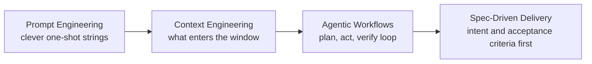

# Vibe Coding & AI Coding Agents: The 2026 Shift

Software development changed faster in 2025–2026 than in the previous decade. The skill that mattered moved from writing a single clever prompt to orchestrating an autonomous coding agent across a real codebase. This chapter is about that shift: what "vibe coding" actually means, when to use it, and how the professional discipline of agentic engineering fits around it.

This is the chapter opener. It frames the vocabulary and the decision model; later docs go deep on specific tools and workflows.

## The Paradigm Shift

For most of the LLM era, "prompt engineering" meant crafting one-shot strings: the right system message, a few examples, the magic phrasing that nudged a model toward a good answer. That skill still matters, but it is no longer where most of the value is.

By 2025–2026, coding models stopped being autocomplete and became agents. They read files, run commands, execute tests, observe failures, and iterate — across many turns and many files. The hard part is no longer the wording of one request. It is supplying the right context, constraints, and feedback loops so the agent can work correctly over a long task.

That is the move from prompt engineering to **context engineering** plus **agentic, spec-driven workflows**:

- **Context engineering** — deciding what information enters the model's window: project conventions, relevant files, tool outputs, prior decisions.
- **Agentic workflows** — letting the model plan, act, and verify in a loop, with the human steering rather than typing every step.
- **Spec-driven development** — writing down intent and acceptance criteria first, then letting the agent implement against that spec.

## What "Vibe Coding" Actually Is

The term **vibe coding** was coined by Andrej Karpathy in February 2025. It described a mode of building where you describe what you want in natural language, accept whatever the model produces, and keep nudging until it runs — going with the vibes.

Simon Willison later gave the term a strict, useful definition: vibe coding means building software with an LLM **without reviewing the code it writes**. If you read, understand, and take responsibility for the generated code, that is not vibe coding — that is ordinary AI-assisted programming. The distinction is about review, not about how much AI you use.

:::note
The strict definition matters because it tracks risk. The question is not "did an AI write this?" but "did a human understand and accept it?"
:::

That distinction tells you where vibe coding belongs:

- **Good for** throwaway scripts, prototypes, spikes, one-off automations, and learning experiments — code whose failure is cheap and whose lifespan is short.
- **Risky for** production systems, code that will be maintained by others, anything handling sensitive data, and safety-critical software. Unreviewed code carries unknown bugs, security holes, and design debt.

Vibe coding is a legitimate tool. The mistake is shipping vibe-coded software into contexts that assume someone understood it.

## The Spectrum: A Decision Guide

Vibe coding sits at one end of a spectrum. Use this guide to pick a mode for the task in front of you.

| If your goal is... | Use this mode | What the human does |
| --- | --- | --- |
| Explore an idea, test feasibility, learn | **Vibe coding** | Describes intent, runs the result, mostly does not review |
| Ship something maintained and correct | **Spec-driven development** | Writes the spec and acceptance criteria, reviews the implementation |
| Build and operate professionally over time | **Agentic engineering** | Steers, architects, reviews, and tests; the agent executes |

The arc in practice: **vibe-code to explore, spec-drive to ship, and treat agentic engineering as the professional umbrella** over both. "Agentic engineering" is the discipline where a human stays accountable — setting architecture, reviewing diffs, owning tests — while delegating execution to coding agents. Vibe coding is something you do *inside* that discipline when the stakes are low, not a replacement for it.

:::warning
The failure mode is using vibe coding's *speed* with production's *stakes*. If the output will be maintained, depended on, or trusted with data, someone must review and understand it — which means you are no longer vibe coding, by definition.
:::

## From "Prompt Engineering" to "Context Engineering"

Mid-2025 saw the field settle on new vocabulary. The shift was not just branding; it reflected what practitioners had learned about making agents reliable.

| Date (2025) | Who | What |
| --- | --- | --- |
| Jun 18 | Tobi Lütke (Shopify) | Framed "context engineering" as the preferred term over "prompt engineering" |
| ~Jun 25 | Andrej Karpathy | Endorsed the framing publicly |
| Sep 29 | Anthropic | Described context engineering as "the natural progression of prompt engineering" |

The core idea: a single prompt is one small slice of what an agent sees. The real work is curating the *entire* context window — instructions, project conventions, retrieved files, tool results, and conversation history — so the model has what it needs and not what it doesn't. Prompt engineering is now treated as a **subset** of context engineering.

For a working team this is good news: it means most of your leverage comes from durable, reusable artifacts (project rule files, conventions, specs) rather than from rediscovering clever phrasings each time.

## How This Chapter Is Organized

The rest of this chapter moves from tools to discipline. Upcoming docs:

- **Claude Code field guide** — Anthropic's coding agent: setup, plan mode, and day-to-day use.
- **OpenAI Codex field guide** — the Codex agent across CLI, IDE, and cloud surfaces.
- **Context engineering with CLAUDE.md / AGENTS.md** — writing project context files that agents read automatically.
- **Agentic workflows** — structuring plan-act-verify loops and multi-step delegation.
- **Spec-driven development** — turning intent into specs and acceptance criteria the agent implements against.
- **Verification & safety** — reviewing agent output, sandboxing, tests, and guardrails for unreviewed code.

(These are named here for orientation; follow the chapter sidebar to reach them.)

## The Tool Landscape

Several agents converged on a similar shape: a CLI and/or IDE surface, a project-level context file the tool reads automatically, and a "plan first, then act" mode. They differ mainly in vendor, surfaces, and the name of the context file.

The table below is a **snapshot as of 2026-06** — tool details change quickly, so treat versions and feature names as point-in-time.

| Tool | Type | Project context file | Plan mode | Notes |
| --- | --- | --- | --- | --- |
| Claude Code | Anthropic; CLI + IDE + web | `CLAUDE.md` | Yes | Reads project memory files automatically |
| OpenAI Codex | CLI + IDE + cloud | `AGENTS.md` | Yes | Multiple surfaces share the agent |
| Cursor | IDE | `.cursor/rules` | Yes | Editor-native agent |
| Gemini CLI | Google; CLI | `GEMINI.md` | Yes | Terminal-based agent |
| Aider | CLI | `CONVENTIONS.md` | Architect mode | Pairs a planning "architect" with an editor model |
| GitHub Copilot | IDE agent + CLI | `.github/copilot-instructions.md` / `AGENTS.md` | Yes | Supports repo-level instructions |

:::note
`AGENTS.md` is emerging as a cross-vendor standard for project context files, stewarded by the Linux Foundation's Agentic AI Foundation (announced December 2025). Several tools above already read it, which makes context files increasingly portable between agents.
:::

## Key Takeaways

- The center of gravity moved from one-shot prompts to **context engineering** and **agentic, spec-driven workflows**.
- **Vibe coding** (Karpathy, 2025-02) means building *without reviewing the code* (Willison). The moment you review and own it, it is ordinary AI-assisted coding.
- Vibe-code to explore, spec-drive to ship; **agentic engineering** is the professional umbrella where a human steers, reviews, and tests.
- **Context engineering** is now the preferred framing, with prompt engineering as a subset.
- Most agents share one pattern: a context file plus a plan mode. Learn the pattern once and it transfers.

:::tip
Coming from the previous chapter? See [Code Generation](/docs/tutorials/code-generation) for prompt-level techniques that still apply inside every agentic workflow.
:::
