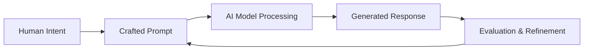

# 什麼是 AI Prompting？

AI prompting 是一門設計和撰寫輸入指令（prompts）的技術，讓你能夠有效地向 AI 語言模型傳達你的意圖，進而產生你想要的輸出結果。這既是一門藝術，也是一門科學，它搭起了人類溝通與機器理解之間的橋樑。

## 核心概念

### Prompt-Response 循環



每一次與 AI 的互動都遵循這個循環，你的 prompt 品質會直接影響回應的品質。

### Prompt 的結構剖析

一個結構良好的 prompt 通常包含以下這些元素：

```python
prompt = """
[角色/背景] - AI 應該扮演什麼角色
[任務] - 你想要 AI 做什麼
[輸入/資料] - 要處理的資訊
[格式] - 你希望輸出的格式是什麼
[限制條件] - 限制或要求
[範例] - 範例輸入/輸出（選擇性）
"""
```

## 為什麼 Prompting 很重要

### 1. 精準度與控制力
有效的 prompting 讓你能精準控制 AI 的輸出，減少模糊不清的回應，提升相關性。

**不好的 Prompt：**
```
寫一些關於行銷的東西
```

**更好的 Prompt：**
```
你是一位數位行銷專家。請寫一份 500 字的指南，說明 SaaS 新創公司的電子郵件
行銷最佳實務，重點放在新用戶引導流程。請包含 3 個具體範例
和可執行的追蹤指標。
```

### 2. 大規模應用的一致性
設計良好的 prompts 能確保在多次互動中產生一致的輸出，這對於正式環境來說非常重要。

### 3. 成本效益
更好的 prompts 通常需要較少的 token 和迭代次數，能降低運算成本和時間。

## Prompting 的類型

### Zero-Shot Prompting（零樣本提示）
要求 AI 執行任務但不提供範例：

```python
prompt = "分析這則評論的情緒：『這個產品超出我的期待！』"
# 預期輸出：正面
```

### Few-Shot Prompting（少樣本提示）
提供範例來引導 AI 的理解：

```python
prompt = """
分析這些評論的情緒：

評論：「品質超爛，用一天就壞了」
情緒：負面

評論：「超棒的產品，大推！」
情緒：正面

評論：「還可以，沒什麼特別的」
情緒：中性

評論：「完全超出我的期待，下次還會再買」
情緒：？
"""
```

### Chain-of-Thought Prompting（思維鏈提示）
鼓勵逐步推理：

```python
prompt = """
請一步一步解決這個問題：

問題：一家水果店蘋果一顆賣 60 元，橘子一顆賣 90 元。
如果我買了 4 顆蘋果和 6 顆橘子，總共要花多少錢？

讓我們一步步思考：
1. 首先，計算蘋果的總價
2. 接著，計算橘子的總價
3. 最後，把兩個金額加起來
"""
```

## 常見的 Prompting 挑戰

### 1. 模糊不清
**問題：** 含糊的指令會導致無法預測的輸出
**解決方案：** 明確說明格式、長度、語氣和要求

### 2. 脈絡遺失
**問題：** AI 在較長的對話中會忘記重要的脈絡
**解決方案：** 強化關鍵資訊並使用系統訊息

### 3. 格式不一致
**問題：** 不同請求之間的輸出格式會有差異
**解決方案：** 提供清楚的格式範本和範例

## 最佳實務預覽

1. **先想清楚最終目標** - 先定義你想要的輸出結果
2. **具體但不囉嗦** - 清楚的指令但不要過度複雜
3. **測試並迭代** - 根據實際輸出來優化 prompts
4. **策略性使用範例** - 明確展示你想要的結果給 AI 看
5. **設定清楚的限制** - 一開始就定義好邊界和限制

## 下一步

現在你已經了解基礎概念，讓我們深入實用技巧：

- **[快速入門指南](./quick-start)** - 使用經過驗證的範本立即獲得成果
- **[Prompt 結構](./prompt-structure)** - 學習有效 prompts 的組成要素
- **[常見模式](./common-patterns)** - 掌握最實用的 prompting 模式

:::info 重點提醒
有效的 AI prompting 就是要清楚傳達你的意圖。你越能精確表達你想要什麼，就能獲得越好的結果。
:::