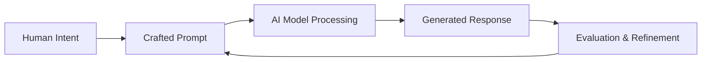

# What is AI Prompting?

AI prompting is the practice of designing and crafting inputs (prompts) that effectively communicate your intent to AI language models to generate desired outputs. It's both an art and a science that bridges human communication with machine understanding.

## Core Concepts

### The Prompt-Response Cycle



Every AI interaction follows this cycle, where the quality of your prompt directly influences the quality of the response.

### Anatomy of a Prompt

A well-structured prompt typically contains these elements:

```python
prompt = """
[ROLE/CONTEXT] - Who the AI should act as
[TASK] - What you want the AI to do
[INPUT/DATA] - The information to work with
[FORMAT] - How you want the output structured
[CONSTRAINTS] - Limitations or requirements
[EXAMPLES] - Sample inputs/outputs (optional)
"""
```

## Why Prompting Matters

### 1. Precision and Control
Effective prompting gives you precise control over AI outputs, reducing ambiguity and increasing relevance.

**Poor Prompt:**
```
Write about marketing
```

**Better Prompt:**
```
You are a digital marketing expert. Write a 500-word guide on email 
marketing best practices for SaaS startups, focusing on onboarding 
sequences. Include 3 specific examples and actionable metrics to track.
```

### 2. Consistency at Scale
Well-designed prompts ensure consistent outputs across multiple interactions, crucial for production environments.

### 3. Cost Efficiency
Better prompts often require fewer tokens and iterations, reducing computational costs and time.

## Types of Prompting

### Zero-Shot Prompting
Asking the AI to perform a task without providing examples:

```python
prompt = "Classify the sentiment of this review: 'The product exceeded my expectations!'"
# Expected output: Positive
```

### Few-Shot Prompting
Providing examples to guide the AI's understanding:

```python
prompt = """
Classify the sentiment of these reviews:

Review: "Terrible quality, broke after one day"
Sentiment: Negative

Review: "Amazing product, highly recommend!"
Sentiment: Positive

Review: "It's okay, nothing special"
Sentiment: Neutral

Review: "Exceeded all my expectations, will buy again"
Sentiment: ?
"""
```

### Chain-of-Thought Prompting
Encouraging step-by-step reasoning:

```python
prompt = """
Solve this step-by-step:

Problem: A store sells apples for $2 each and oranges for $3 each. 
If I buy 4 apples and 6 oranges, how much do I spend?

Let me think through this:
1. First, calculate the cost of apples
2. Then, calculate the cost of oranges  
3. Finally, add them together
"""
```

## Common Prompting Challenges

### 1. Ambiguity
**Problem:** Vague instructions lead to unpredictable outputs
**Solution:** Be specific about format, length, tone, and requirements

### 2. Context Loss
**Problem:** AI forgets important context in longer conversations
**Solution:** Reinforce key information and use system messages

### 3. Inconsistent Formatting
**Problem:** Output format varies between requests
**Solution:** Provide clear formatting templates and examples

## Best Practices Preview

1. **Start with the end in mind** - Define your desired output first
2. **Be specific but not verbose** - Clear instructions without unnecessary complexity
3. **Test and iterate** - Refine prompts based on actual outputs
4. **Use examples strategically** - Show the AI exactly what you want
5. **Set clear constraints** - Define boundaries and limitations upfront

## Next Steps

Now that you understand the fundamentals, let's dive into practical techniques:

- **[Quick Start Guide](./quick-start)** - Get immediate results with proven templates
- **[Prompt Structure](./prompt-structure)** - Learn the anatomy of effective prompts
- **[Common Patterns](./common-patterns)** - Master the most useful prompting patterns

:::info Key Takeaway
Effective AI prompting is about clear communication of intent. The more precisely you can express what you want, the better results you'll achieve.
:::