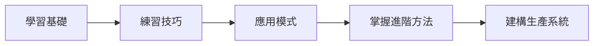

# 歡迎來到 AI 提示詞寶典

掌握**高效 AI 提示詞撰寫技巧**，透過精準設計的提示詞，徹底發揮 AI 語言模型的強大潛力！

## 什麼是 AI 提示詞工程？

AI 提示詞工程就是一門撰寫精準、有脈絡指令的技術，讓 AI 模型產出你想要的結果。不管你是在開發應用程式、自動化工作流程，還是提升生產力，有效的提示詞就是你成功的關鍵！

## 為什麼這份指南超重要？

在 AI 快速發展的時代，平庸跟卓越結果的差別，不只在於你用哪個模型，更在於**你怎麼跟它溝通**。這份指南會教你：

- **基礎原則** - 有效提示詞工程的核心概念
- **實戰技巧** - AI 專家都在用的技術
- **真實案例** - 跨領域的實際應用
- **進階策略** - 處理複雜場景的方法
- **最佳實踐** - 生產環境的專業做法

## 你會學到什麼？

### 🎯 提示詞基礎
掌握提示詞結構、情境設定和指令清晰度等核心概念，打好跟 AI 互動的基礎。

### 🔧 實用技巧
學習經過實戰驗證的提示詞模式，包括少樣本學習（few-shot learning）、思維鏈推理（chain-of-thought）和角色扮演提示。

### 🚀 進階策略
探索提示詞串接、動態情境管理和多模態提示等高階技術。

### 💡 實務應用
看看提示詞技術如何應用在內容創作、程式碼生成、數據分析、客戶服務等領域。

## 開始上手

準備好改變你使用 AI 的方式了嗎？從我們的[基礎概念](/docs/fundamentals/what-is-prompting)開始打好基礎，然後逐步學習實用教學和進階技巧。



:::tip 快速上手
第一次接觸 AI 提示詞？直接跳到我們的[快速入門指南](/docs/fundamentals/quick-start)，馬上看到實際成果！
:::

## 互動式範例

在這份指南中，你會找到很多互動式程式碼範例，可以直接複製並修改成你自己的專案：

```python
# 範例：基本提示詞結構
prompt = """
你是一位專精於數據分析的得力助手。

任務：分析以下的銷售數據並提供洞察。
背景：2024 年第三季績效檢討
數據：[sales_data]

請提供：
1. 觀察到的關鍵趨勢
2. 績效亮點
3. 第四季建議

請以結構化報告格式回覆。
"""
```

一起開始你的 AI 提示詞大師之旅吧！