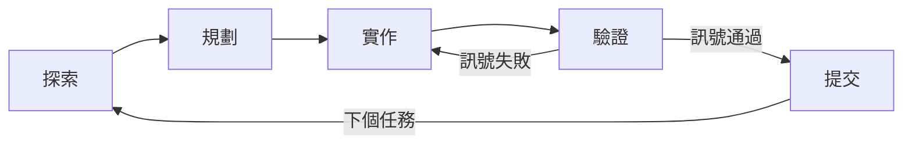

# 代理式工作流程：規劃、委派、驗證

代理式（agentic）編程工具不是自動補全。它跑的是一個迴圈：讀程式碼、擬出計畫、進行修改、檢查成果，然後重複。要拿到好結果，重點不在於提示詞怎麼措辭，而在於*工作流程的紀律*——你怎麼界定一個 session 的範圍、委派什麼出去、怎麼平行處理，以及怎麼逼 agent 證明它的成果。這篇文件講的就是這層跨工具的工作流程。至於某個特定工具怎麼實作 plan mode、subagent 或 headless 執行，請看 [Claude Code](/docs/vibe-coding/claude-code) 和 [OpenAI Codex](/docs/vibe-coding/openai-codex) 指南；想對整套方法有個入門概念，請看 [Vibe Coding 總覽](/docs/vibe-coding/overview)。

## 代理式迴圈是整個脊椎

每一場有產出的 session 都走同樣這五個階段。把它們當成明確的階段來對待，別讓它們糊成一團。



- **探索**——在動任何東西之前，先讓 agent 讀過相關檔案、把問題重新講一遍。
- **規劃**——產出一份寫下來的計畫，列出步驟和牽涉到的檔案。
- **實作**——進行修改，一次一個完整一致的變更。
- **驗證**——跑一個機器可檢查的訊號（見下文），失敗就回到上一步。
- **提交**——把可運作的狀態存下來，然後往下走。

### 把規劃和執行分開

最高槓桿的一個習慣，就是*把計畫和修改分開*。大多數代理式工具都內建一個唯讀的「plan mode」，正是為了這件事：agent 可以調查、可以提案，但在你核可之前不能改檔案。審一份計畫很便宜；審一百行錯誤的 diff 可就不便宜了。先核可、調整方向或細修計畫——然後讓執行針對一個雙方都同意的目標跑下去。

兩份工具指南會說明各自怎麼進出 plan mode；這篇文件只主張原則。當驗證失敗時退回規劃階段，是正常而且在預期之內的——圖裡那條往回走的邊，就是迴圈在做它該做的事。

## Context 是核心限制

在工作流程這一層，你在管理的資源就是 context window（脈絡視窗）。每一次讀檔、每一筆工具結果、每一次走錯路，都會留在 session 裡，搶奪模型的注意力。由此衍生出兩條規則。

**讓一個 session 只聚焦在一個完整一致的任務上。**一個 session 先修了一個 bug，又改了某個模組的名字，接著又去探索一個新功能，就會累積一堆不相干的歷史。模型開始把不同的關注點混在一起，品質就下滑了——這就是經典的「廚房水槽（kitchen-sink）」式 session。

**在不相干的任務之間重置或壓縮（compact）。**當你切換到真正全新的東西時，把 context 清掉（重新開始）或壓縮成一段簡短的摘要。一個乾淨的視窗配上一份聚焦的簡報，幾乎每次都勝過一個塞滿過時細節的長視窗。

這是工作流程層級的觀點。至於 context 檔案或系統提示*裡面*到底該放什麼、又該怎麼組織，是 Context Engineering 那篇文件的主題（這裡只點名提到；它自成一個獨立的題目）。

## 委派給 subagent

subagent 是一個獨立的 agent 執行，它在*自己的* context window 裡運作，而且只回報一段摘要。要做大量的閱讀又不污染你的主 session，這是最乾淨的做法。

這個模式是這樣：當一個任務需要大範圍的研究——「找出我們所有建立資料庫連線的地方」、「跨這十二個檔案總結一下 auth 是怎麼運作的」——就把它交給 subagent。它會燒掉它自己的 context 去翻檔案，然後回傳幾段文字。你的主 session 維持精簡，注意力繼續放在你真正在乎的任務上。

subagent 也能承擔**專門的角色**：

- 一個 **reviewer（審查者）**，讀一份 diff 並回報缺漏（在下面的驗證一節會講到），
- 一個 **test-writer（測試撰寫者）**，根據一份 spec 寫測試，但看不到實作內容，
- 一個 **researcher（研究者）**，蒐集事實並呈上一段摘要。

每一種情況的紀律都一樣：subagent 吸收掉雜訊；主 context 只收到提煉過的結果。

## 用 git worktree 來平行處理

當你手上有好幾個*彼此獨立*的任務時，就讓多個 agent 同時跑。讓這件事成為可能的機制就是 **git worktree**：一個 worktree 是一個獨立的工作目錄，背後接的是同一個 repository，每個各自待在自己的分支上。給每個 agent 自己的 worktree，agent 們就會改不同的 checkout，所以它們的變更在磁碟上永遠不會撞在一起。

```bash
# 每個 agent 一個隔離的 checkout 加一個分支
git worktree add ../proj-feature-a -b feature-a
git worktree add ../proj-feature-b -b feature-b
# 把每個 agent session 指到各自的目錄；完成後再合併分支
```

要沿著**功能或領域的邊界**來拆解工作，別亂拆：

- 拆那些動到*不同*檔案的工作——獨立的功能、獨立的模組、互不相干的 bug 修正。
- **不要**拆那些動到*同一批*檔案的工作；對共用程式碼做平行修改，會產生合併衝突和白做的執行，把你省下來的時間全吃光。

這裡有個實務上的經驗法則——不是硬性規定——大約**同時跑兩到四個 agent**通常是個可控的上限。超過這個數，光是審查、引導、合併的人力成本，通常就會蓋過吞吐量上的好處。把這個數字當成起點，再依你的任務和你對切換脈絡的忍受度去調。

## 驗證是迴圈的一個階段，不是事後補做的事

agent 應該自己把迴圈收尾。要讓這件事成為可能，你得給它一個**機器可檢查的訊號**——某個有明確通過/失敗結果的東西：

- 一套測試（exit code），
- 一個 build 或編譯步驟（exit code），
- 一個 linter 或型別檢查器，
- 給 UI 工作用的一張螢幕截圖或視覺 diff。

手上有了一個真正的訊號，agent 就能自己迭代，不用每一步都要你在迴圈裡：修改、執行、讀失敗訊息、修好、重複。這條規則是**要證據，不要嘴上講講**。「我修好了」是不能接受的；一次通過的測試執行、一個乾淨的 build，或一份輸出的 diff 才可以。如果 agent 宣稱成功，就要它給出它跑的指令，以及它看到的輸出。

### 撰寫者／審查者模式

把寫程式的那個 agent，跟一個**在全新 context 裡執行的獨立 reviewer** 配成一對。reviewer 沒看過撰寫者的推理或自我合理化，所以它會用自己的角度去讀 diff，比較有機會抓到撰寫者自己唬弄過去的東西。

在全新 session 裡的 reviewer 是個*好用的模式*，而換一個不同的模型還能多帶來一個視角——但要說某一種做法可被證明勝過另一種，目前的證據都只是軼事性質，所以把它當成一種技巧，而不是一個保證。

要刻意界定 reviewer 的範圍。一個被叫去「找出任何可以更好的地方」的 reviewer，會無中生有地製造工作，把你推向過度工程。應該改成這樣：

> 只標出會影響正確性或既定需求的缺漏。不要建議任何風格上或臆測性的改進。

這是工作流程層級的處理方式。驗證的*關卡（gate）*、安全沙箱的深度，以及把測試驅動開發當成一套方法論，都會在接下來的 **Verification & Safety** 那篇文件裡完整講到（這裡只點名；不在此處完整涵蓋）。也可以看看[程式碼生成教學](/docs/tutorials/code-generation)裡的實作範例。

## 把 spec 當成較大型工作的交接點

任何比單一一致變更還大的東西，都別從修改開始——從一份 spec 開始。可靠的流程順序是：

1. **先訪談。**讓 agent 在動筆寫任何東西之前先問你問題：這個功能要做什麼、有哪些限制、有哪些邊界情況、成功長什麼樣子。
2. **寫一份自足的 `SPEC.md`。**它應該點名要建立或變更的檔案和介面，明確寫出哪些是**範圍外（out of scope）**，並定義一個**端到端的驗證步驟**——一個確認整件事真的能運作的具體方法。
3. **在全新的 session 裡執行。**開一個乾淨的 context，把它指向 `SPEC.md`，讓它去實作。這份 spec 帶著所有需要的東西；那場規劃對話不需要跟著一起來。

一份好的 spec 要自足到一個程度：一個全新的 agent——或一個不同的隊友——不用看到原本那場討論就能執行它。這就是通往 **Spec-Driven Development（規格驅動開發）**的橋樑，那是另一篇獨立文件的內容（這裡只點名）。

## headless 與 CI 執行

同一個迴圈也能以非互動的方式跑。headless 的呼叫——`claude -p` 和 `codex exec`——接收一個提示、一路跑到完成、然後退出，鍵盤前沒有人。用它們來做：

- **CI pipeline**——把生成、修正或審查當成 pipeline 裡的一個步驟。
- **pre-commit hook**——在一筆 commit 落地之前做 lint、格式化或基本健全性檢查。
- **跨大量檔案的 fan-out（扇出）**——對一大批檔案套用同樣的轉換，一個檔案或一批檔案對應一次呼叫。

因為現場沒有人在核可動作，headless 執行需要護欄：

- **明確界定權限範圍**——只授予這次執行需要的檔案和指令存取權；其餘一律拒絕。
- **給執行設上界限**——限制回合數、設一個 timeout，這樣一個搞混的 agent 才不會無限迴圈下去或把預算燒光。
- **在沙箱裡執行**——在一個隔離的環境裡跑，讓一個壞動作碰不到它自己 checkout 以外的任何東西。

這些是跨工具的原則；確切的旗標和設定就放在各工具的指南裡。

:::warning 反模式
- **在被污染的 session 裡硬要更正。**當一個 agent 跑偏時，別再往同一個被毒化的 context 裡堆更多更正——那段歷史本身就是問題所在。重置、寫一份乾淨的簡報、重新開始。
- **追著 reviewer 的每一個小毛病跑。**一個什麼都要標的 reviewer，會把你一路帶進過度工程。針對正確性和需求缺漏動手；臆測性的雕琢就別理它。
- **沒有界限的「什麼都查一查」。**一個開放式的研究提示，會把 context 和時間吃光，卻看不到一個清楚的終點。把它界定成一個具體的問題，或委派給一個會回傳摘要的 subagent。
:::

:::tip 接下來看這裡
- [Vibe Coding 總覽](/docs/vibe-coding/overview)——整體的大局，以及什麼時候該動用這些工具。
- [Claude Code 指南](/docs/vibe-coding/claude-code)——Claude Code 裡的 plan mode、subagent 和 headless 執行。
- [OpenAI Codex 指南](/docs/vibe-coding/openai-codex)——Codex 裡同樣的這幾個工作流程階段。
:::
