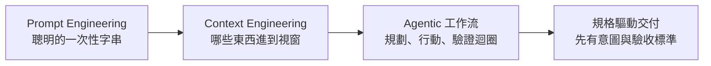

# Vibe Coding 與 AI 程式代理：2026 年的大轉變

軟體開發在 2025～2026 年的變化速度，比過去十年加起來還快。真正重要的技能，已經從「寫出一個聰明的 prompt」轉移到「在真實的程式碼庫上指揮一個自主的程式代理（coding agent）」。這一章談的就是這個轉變：vibe coding 到底是什麼意思、什麼時候該用它，以及 agentic engineering（代理式工程）這門專業如何把它包在裡面一起運作。

這是整章的開場。它先幫你建立起該有的詞彙跟決策模型；後面的文件再針對特定工具與工作流深入展開。

## 典範轉移

在 LLM 時代的大部分時間裡，「prompt engineering（提示工程）」指的就是雕琢一段一次性的字串：對的 system message、幾個範例、那句能把模型推向好答案的神奇措辭。這項技能現在還是有用，但它已經不是大部分價值所在了。

到了 2025～2026 年，程式模型不再只是自動補完（autocomplete），而是變成了代理（agent）。它們會讀檔案、跑指令、執行測試、觀察失敗，然後反覆迭代，橫跨好多輪、好多個檔案。難的地方已經不是一個請求要怎麼措辭，而是怎麼餵給代理對的 context、對的限制條件，以及對的回饋迴圈，好讓它能在一個長任務裡正確地做下去。

這就是從 prompt engineering 轉向 **context engineering（情境工程）** 加上 **agentic、spec-driven（規格驅動）工作流** 的過程：

- **Context engineering（情境工程）**：決定哪些資訊會進到模型的視窗裡，包括專案慣例、相關檔案、工具輸出、先前的決策。
- **Agentic 工作流**：讓模型在一個迴圈裡規劃、行動、驗證，由人來掌舵，而不是每一步都要你親手打字。
- **Spec-driven development（規格驅動開發）**：先把意圖和驗收標準寫下來，再讓代理照著這份 spec 去實作。

## 「Vibe Coding」到底是什麼

**vibe coding** 這個詞，是 Andrej Karpathy 在 2025 年 2 月提出來的。它形容的是一種開發模式：你用自然語言描述你想要什麼，模型生出什麼你就照單全收，然後一直推它、推到它能跑起來為止，整個就是跟著感覺（vibes）走。

後來 Simon Willison 給了這個詞一個嚴格、而且很實用的定義：vibe coding 就是用 LLM 來開發軟體，但**完全不去審查它寫出來的程式碼**。如果你有讀、有看懂、而且願意為生成的程式碼負責，那就不是 vibe coding，而只是普通的 AI 輔助開發而已。這個區別的重點在於「有沒有審查」，而不是「你用了多少 AI」。

:::note
這個嚴格定義之所以重要，是因為它對應到的是風險。真正要問的問題不是「這段是不是 AI 寫的？」，而是「有沒有人看懂並接受了它？」
:::

這個區別也告訴你 vibe coding 該用在哪：

- **適合用在**：用完即丟的腳本、原型、技術探路（spike）、一次性的自動化，還有學習用的小實驗：這類程式碼就算壞掉成本也很低、壽命也很短。
- **用在這些地方就有風險**：正式環境（production）系統、會交給別人維護的程式碼、任何會處理敏感資料的東西，還有安全攸關的軟體。沒審查過的程式碼藏著你不知道的 bug、資安漏洞，還有設計上的技術債。

vibe coding 是個正當的工具。會出問題的，是把 vibe-coded 出來的軟體，丟進那種預設「有人看懂過」的場景裡。

## 光譜：一份決策指南

vibe coding 落在一道光譜的其中一端。用下面這份指南，幫你針對眼前的任務挑一個合適的模式。

| 如果你的目標是… | 用這個模式 | 人要做的事 |
| --- | --- | --- |
| 探索一個想法、測試可行性、學習 | **Vibe coding** | 描述意圖、跑出來看結果，大致上不審查 |
| 交付一個會被維護、而且要正確的東西 | **Spec-driven development（規格驅動開發）** | 寫出 spec 和驗收標準，並審查實作 |
| 長期、專業地建置與維運 | **Agentic engineering（代理式工程）** | 掌舵、做架構、審查、測試；由代理負責執行 |

實務上的走法大概是這樣：**用 vibe coding 來探索、用規格驅動來交付，然後把 agentic engineering 當成涵蓋這兩者的專業大傘**。「Agentic engineering」是一門紀律：人始終要負責（訂架構、審 diff、扛測試），同時把執行這件事委派給程式代理。vibe coding 是你在這門紀律「裡面」、在風險很低的時候做的事，它不是用來取代這門紀律的。

:::warning
最常見的翻車方式，就是拿 vibe coding 的*速度*，去搭配正式環境的*風險*。如果產出的東西會被維護、會被依賴、或要拿去處理資料，那就一定要有人去審查、去看懂它，而那一刻，按定義，你就已經不是在做 vibe coding 了。
:::

## 從「Prompt Engineering」到「Context Engineering」

2025 年中，這個領域大致敲定了一套新詞彙。這個轉變不只是換個包裝；它反映的是從業者在「怎麼讓代理變可靠」這件事上學到的東西。

| 日期（2025） | 是誰 | 做了什麼 |
| --- | --- | --- |
| 6/18 | Tobi Lütke（Shopify） | 把「context engineering」定調為比「prompt engineering」更恰當的說法 |
| 約 6/25 | Andrej Karpathy | 公開認同了這個說法 |
| 9/29 | Anthropic | 把 context engineering 形容為「prompt engineering 的自然延伸」 |

核心觀念是：單一一個 prompt，只是代理所看到內容裡很小的一片。真正的工作，是去策劃*整個* context 視窗（指令、專案慣例、撈進來的檔案、工具結果、對話歷史），讓模型剛好拿到它需要的，而不是它不需要的。prompt engineering 現在被當成 context engineering 的一個**子集**。

對一個正在運作的團隊來說，這是個好消息：它代表你大部分的施力點，來自那些耐用、可重複利用的產物（專案規則檔、慣例、spec），而不是每次都得重新去摸索那句聰明的措辭。

## 這一章怎麼安排

這一章接下來會從工具一路走到紀律。後面會有這些文件：

- **[Claude Code 實戰指南](/docs/vibe-coding/claude-code)**：Anthropic 的程式代理，包含設定、plan mode，以及日常怎麼用。
- **[OpenAI Codex 實戰指南](/docs/vibe-coding/openai-codex)**：橫跨 CLI、IDE 與雲端介面的 Codex 代理。
- **[用 CLAUDE.md / AGENTS.md 做 context engineering](/docs/vibe-coding/context-engineering)**：撰寫代理會自動讀取的專案情境檔。
- **[Agentic 工作流](/docs/vibe-coding/agentic-workflows)**：怎麼把「規劃—行動—驗證」迴圈和多步驟委派架起來。
- **[Spec-driven development（規格驅動開發）](/docs/vibe-coding/spec-driven-development)**：把意圖轉成 spec 和驗收標準，讓代理照著去實作。
- **[驗證與安全](/docs/vibe-coding/verification-and-safety)**：審查代理的產出、sandboxing（沙箱）、測試，還有給未審查程式碼的護欄。

（這裡先把它們列出來幫你定位；要進去看就跟著本章的側邊欄走。）

## 工具版圖

好幾個代理最後都收斂到差不多的形狀：一個 CLI 和／或 IDE 介面、一個工具會自動讀取的專案層級情境檔，再加上一個「先規劃、再行動」的模式。它們之間的差別，主要就在於廠商、介面，還有那個情境檔叫什麼名字。

下面這張表是**截至 2026-06 的快照**：工具細節變得很快，所以版本和功能名稱請當成某個時間點的狀態來看。

| 工具 | 類型 | 專案情境檔 | Plan mode | 備註 |
| --- | --- | --- | --- | --- |
| Claude Code | Anthropic；CLI + IDE + 網頁 | `CLAUDE.md` | 有 | 會自動讀取專案記憶檔 |
| OpenAI Codex | CLI + IDE + 雲端 | `AGENTS.md` | 有 | 多個介面共用同一個代理 |
| Cursor | IDE | `.cursor/rules` | 有 | 編輯器原生的代理 |
| Gemini CLI | Google；CLI | `GEMINI.md` | 有 | 終端機型的代理 |
| Aider | CLI | `CONVENTIONS.md` | Architect mode | 把負責規劃的「architect」跟負責編輯的模型配成一對 |
| GitHub Copilot | IDE 代理 + CLI | `.github/copilot-instructions.md` / `AGENTS.md` | 有 | 支援 repo 層級的指令 |

:::note
`AGENTS.md` 正逐漸變成跨廠商的專案情境檔標準，由 Linux Foundation 旗下的 Agentic AI Foundation 主導（2025 年 12 月宣布）。上表中好幾個工具都已經會讀它，這也讓情境檔在不同代理之間越來越可以互通搬移。
:::

## 重點整理

- 重心已經從一次性的 prompt，移到了 **context engineering（情境工程）** 以及 **agentic、規格驅動的工作流**。
- **Vibe coding**（Karpathy，2025-02）指的是**不審查程式碼**就拿來開發（Willison 的定義）。你一旦開始審查並為它負責，它就變成普通的 AI 輔助開發了。
- 用 vibe coding 來探索、用規格驅動來交付；**agentic engineering（代理式工程）** 則是那把專業大傘，傘底下由人來掌舵、審查、測試。
- **Context engineering** 現在是比較被接受的說法，prompt engineering 則是它的一個子集。
- 大多數代理都共用同一套模式：一個情境檔加上一個 plan mode。這套模式學會一次，就能整套搬到別的代理上用。

:::tip
從上一章接過來的嗎？可以看看 [Code Generation](/docs/tutorials/code-generation)，裡面那些 prompt 層級的技巧，在每一種 agentic 工作流裡其實都還是用得上。
:::
